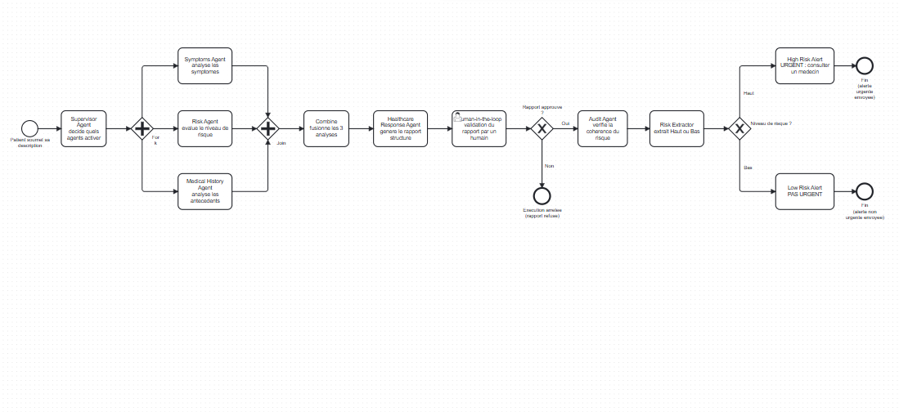
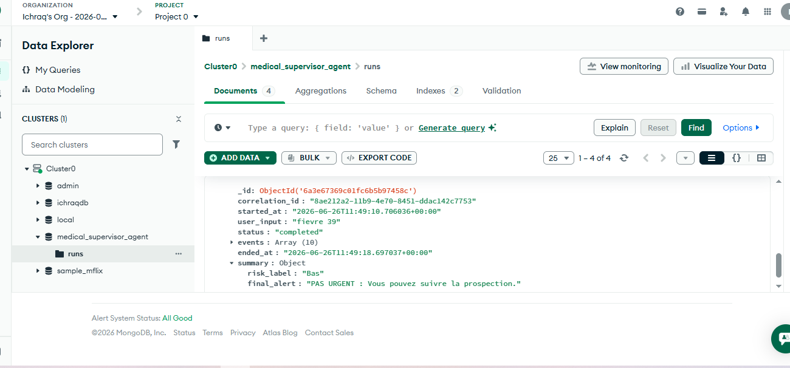

# Medical Supervisor Agent

Architecture multi-agents (pattern Supervisor) pour le secteur santé — LangGraph, FastAPI, monitoring (Correlation ID, latence, tokens), CI/CD, conteneurisation Docker.

Voir [AGENT_CARD.md](AGENT_CARD.md) et [RUNBOOK.md](RUNBOOK.md) pour la documentation complète.

## Déploiement en production (Railway)

- **Interface utilisateur :** https://med-agent.up.railway.app/ui
- **Dashboard de monitoring :** https://med-agent.up.railway.app/dashboard
- **Documentation API (Swagger) :** https://med-agent.up.railway.app/docs

> Le monitoring est stocké de façon **persistante dans MongoDB Atlas** (base `medical_supervisor_agent`, collection `runs`) — l'historique survit désormais aux redémarrages et redéploiements du service. Lance le test ci-dessous pour ajouter une exécution et voir le dashboard se peupler.

## Comment fonctionne l'agent

1. Un patient décrit ses symptômes (`user_message`) via `POST /diagnose`.
2. Le **Supervisor Agent** (LLM Groq) décide quels sous-agents activer selon le cas.
3. **3 agents tournent en parallèle** : analyse des symptômes, évaluation du risque, antécédents médicaux.
4. Un nœud **Combine** fusionne les 3 analyses, puis le **Healthcare Response Agent** génère un rapport structuré.
5. **Pause obligatoire (human-in-the-loop)** : l'exécution s'arrête et attend une validation humaine via `POST /diagnose/{thread_id}/approve` — rien n'est envoyé sans accord humain.
6. Si approuvé : un **Audit Agent** vérifie la cohérence du niveau de risque, puis le **SmartRouter** route vers une alerte finale :
   - Risque **Haut** → `"URGENT : Le patient doit visiter le medecin."`
   - Risque **Bas** → `"PAS URGENT : Vous pouvez suivre la prospection."`

Chaque exécution reçoit un `correlation_id` unique, et chaque nœud du graphe est tracé (statut, latence, tokens Groq consommés) — visible sur `/dashboard` et `/runs/{correlation_id}`.

### Diagramme BPMN



Fichier source : [medical_supervisor_agent.bpmn](medical_supervisor_agent.bpmn) (importable dans [bpmn.io](https://bpmn.io)).

## Comment tester (exemple complet)

**Le plus simple :** ouvre https://med-agent.up.railway.app/ui, tape les symptômes dans le formulaire, clique "Envoyer", puis "Approuver" ou "Refuser".

Sinon, avec `curl` (ou directement dans `/docs`, en cliquant "Try it out" sur chaque route) :

```bash
# 1. Lancer un diagnostic
curl -X POST https://med-agent.up.railway.app/diagnose \
  -H "Content-Type: application/json" \
  -d '{"user_message": "Douleur abdominale intense depuis 6 heures, avec vomissements.", "thread_id": "demo-1"}'

# 2. Approuver le rapport généré (human-in-the-loop) pour terminer l'execution
curl -X POST https://med-agent.up.railway.app/diagnose/demo-1/approve \
  -H "Content-Type: application/json" \
  -d '{"approved": true}'

# 3. Voir le resultat dans le dashboard
# -> https://med-agent.up.railway.app/dashboard
```

La réponse de l'étape 2 contient `risk_label` ("Haut" ou "Bas") et `final_alert` (le message d'alerte envoyé). Rafraîchis `/dashboard` après l'étape 2 pour voir la latence et les tokens consommés par chaque nœud du graphe.

## Endpoints

- `GET /ui` — interface utilisateur (formulaire symptômes → rapport → approbation → alerte)
- `POST /diagnose` — lance le diagnostic, s'arrête avant validation humaine
- `POST /diagnose/{thread_id}/approve` — valide (`approved: true/false`) et termine l'exécution
- `GET /health` — sonde de disponibilité
- `GET /dashboard` — tableau de bord (latence, tokens, Correlation ID)
- `GET /metrics` — métriques agrégées (JSON)
- `GET /runs` — liste des exécutions récentes
- `GET /runs/{correlation_id}` — détail nœud par nœud d'une exécution

## Stockage du monitoring (MongoDB)

Chaque exécution est enregistrée dans **MongoDB Atlas** :
- **Base de données :** `medical_supervisor_agent`
- **Collection :** `runs`
- **Index :** `correlation_id` (unique)

Si `MONGODB_URI` est absente ou la connexion échoue, le service bascule automatiquement (et silencieusement) sur un cache en mémoire — utile en développement local sans base de données, mais non persistant.



## Variables d'environnement

- `GROQ_API_KEY` (requise) — clé API Groq (console.groq.com/keys), configurée comme variable d'environnement dans Railway (onglet Variables), jamais committée dans Git.
- `MONGODB_URI` (recommandée, déjà configurée en production) — chaîne de connexion MongoDB Atlas (`mongodb+srv://...`) pour un monitoring persistant qui survit aux redéploiements.
- `MONGODB_DB` (optionnelle) — nom de la base MongoDB à utiliser (défaut : `medical_supervisor_agent`).
